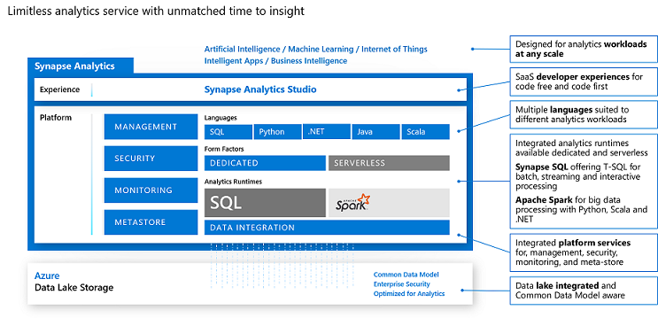
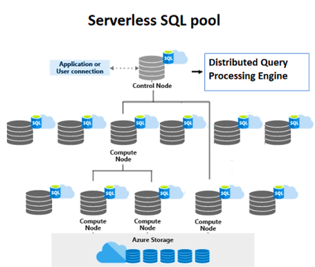

# Synapse Analytics - Serverless Pool
This is a quickstart guide for users starting new with Azure Synapse Serverless Pools. 
## **Quick Recap on Synapse Analytics**


Azure Synapse analytics is a limitless analytical platform on any type or volume of data. Essentially it is a combination of tools required to ingest,process, analyze and visualize data using unified interface called Synapse Studio

# Synapse Serverless Pool - On-Demand SQL Pool
In this article I am going to cover the Synpse Serverless Pool. Objective is to create a single page that demonstrates all capabilities of the Synapse Serverless Pool. Before we jump into technical stuff lets answer some frequently asked questions

**What is Synapse Serverless Pool?**
> Serverless Pool is an On-demand distributed SQL query engine to query your data stored in Azure Storage. It abstracts users from the overhead of setting up and maintaining clusters

**How do users get charged?**
> It uses Pay-per-Use Model. Users only pay for the amount of data scanned by the query

**In Which Scenarios I can use Serverless Pools?**
> * Ad-hoc querying on raw and processed data stored in Azure Storage
> * Need to perform simple to medium complex transformations in cost effective manner
> * Team having SQL Only skillset

**What is the performance penalty in Serverless Architecture?**
> Since it is serverless performance of first query will be slow. Behind the scene Synapse will try to allocate resources for you 

**When to use Dedicated SQL Pool and Serverless Pool?**

 Features | Serverless Pools | On Demand Pools
 ---------|----------|---------
  Cluster Provisioning | Not Required | Required
  SLA | few Seconds to Mins | Milli Sec
  Querying on Data Lake |Y| Y
 Cost | Per Query   | preset DWUs   |

## **Architecture of the Synapse Serverless**



**Architeure Highlights**
* Both Architectures uses Control Node and Compute Node
* Control node splits user query into smaller queries called as Tasks
* Tasks will be executed on Compute Nodes
* Coordination of activities among the Compute Nodes is managed by Control Nodes
* Users always interact with Control Node

Lets look at the TSQL in Serverless Pool

**TSQL Support in Synapse Serverless**
TSQL support in serverless is enhanced to support querying semi-structured data e.g. JSON
> * [SELECT](https://docs.microsoft.com/en-us/sql/t-sql/queries/select-transact-sql?view=azure-sqldw-latest&preserve-view=true) variations are supported
> * [CETAS](https://docs.microsoft.com/en-us/azure/synapse-analytics/sql/develop-tables-cetas#cetas-in-serverless-sql-pool) - External Table
> * DDL statements for views and security
> * Refer [doc](https://docs.microsoft.com/en-us/azure/synapse-analytics/sql/overview-features) for supported commands


**<h1 style="color:Tomato;">Following SQL Concpets are not supported</h1>**
> * Trigger
> * Materialized Views
> * DML Statements
> * DDL Statements otherthan mentioned above

**Lets Jump to Hands-on**

## **Scenario - 1: Create Database, Schema, External File Format and External Table**
First Create a Database using following command and then set the Master Key </br>
```
CREATE DATABASE synsvrlessdemo;
CREATE MASTER KEY ENCRYPTION BY PASSWORD = '<STRONG_PWD>'-- Master key is a symmetric key used to protect the private keys and asymmetric keys that are present in the database.
```
 _Note: - This is a one time setup_ </br>

Lets Create Schema and External Table </br>
```
Create SCHEMA csv;
Create SCHEMA parquet;
```
> Create External Table -
> 1.  Create DataSource to connect to remote storage
> 2.  Create [External File format](https://docs.microsoft.com/en-us/sql/t-sql/statements/create-external-file-format-transact-sql?view=sql-server-ver15&tabs=delimited) to represent the data stored in external storage
> 3.  Create External Table

```
-- Create Datasource By connectign to remote storage
CREATE DATABASE SCOPED CREDENTIAL synsvrlessdemo2
WITH IDENTITY='SHARED ACCESS SIGNATURE',  
SECRET = 'sv=2018-03-28&ss=bf&srt=sco&sp=rl&st=2019-10-14T12%3A10%3A25Z&se=2061-12-31T12%3A10%3A00Z&sig=KlSU2ullCscyTS0An0nozEpo4tO5JAgGBvw%2FJX2lguw%3D'
GO
CREATE EXTERNAL DATA SOURCE SqlOnDemandDemo WITH (
    LOCATION = 'https://sqlondemandstorage.blob.core.windows.net',
    CREDENTIAL = synsvrlessdemo2
);

-- File Format
CREATE EXTERNAL FILE FORMAT QuotedCsvWithHeader
WITH (  
    FORMAT_TYPE = DELIMITEDTEXT,
    FORMAT_OPTIONS (
        FIELD_TERMINATOR = ',',
        STRING_DELIMITER = '"',
        FIRST_ROW = 2
    )
);

```

## **Scenario - 2: Execute Query Directly and using External Table**
Direct Query using OPENROWSET functons
```
SELECT TOP 10 *
FROM OPENROWSET
  (
      BULK 'csv/population/*.csv',
      DATA_SOURCE = 'SqlOnDemandDemo',
      FORMAT = 'CSV', PARSER_VERSION = '2.0'
  )
WITH
  (
      country_code VARCHAR (5)
    , country_name VARCHAR (100)
    , year smallint
    , population bigint
  ) AS r
WHERE
  country_name = 'Luxembourg' AND year = 2017

-- Create External Table
CREATE EXTERNAL TABLE csv.population
(
    [country_code] VARCHAR (5) COLLATE Latin1_General_BIN2,
    [country_name] VARCHAR (100) COLLATE Latin1_General_BIN2,
    [year] smallint,
    [population] bigint
)
WITH (
    LOCATION = 'csv/population/population.csv',
    DATA_SOURCE = SqlOnDemandDemo,
    FILE_FORMAT = QuotedCsvWithHeader
);

SELECT TOP 10 *
FROM csv.population
WHERE
  country_name In ('India','Bhutan','Slovenia','Luxembourg') AND year = 2017
  ORDER by country_name ASC

```
## **Scenario - 3: Work with Linked Storages and Query on Parquet Files**

> * What is a Linked Storage?
> * Supported Linked Storages and How to Add?
> * Create External Table 'NYCData' using Linked Storage. Dont forget to change the file name and folder name to '*'</br> [File Meta Concept](https://docs.microsoft.com/en-us/azure/synapse-analytics/sql/query-data-storage#file-metadata-functions) is important from Partitioning perspective 


```
SELECT
MONTH(pickup_datetime) as month, COUNT(*) AS cnt
FROM
parquet.NYCData
GROUP BY MONTH(pickup_datetime)
ORDER by MONTH(pickup_datetime) ASC

-- Join tables
Select top 10 
   nyc.pickup_datetime,nyc.fare_amount,nyc.tip_amount,ref.description 
   FROM parquet.NYCData nyc 
   JOIN parquet.NYCPRF ref 
   ON nyc.payment_type = ref.payment_type 
   WHERE nyc.tip_amount >5
```
## **Scenario - 4: Conneting From Local Machine**
> * [ Connect to SQL On Demand using sql end point](https://docs.microsoft.com/en-us/azure/synapse-analytics/sql/get-started-azure-data-studio)

## **Scenario - 5: Best Practices**
Refer [Best Practices](https://docs.microsoft.com/en-us/azure/synapse-analytics/sql/best-practices-serverless-sql-pool) from Documentation 
>  Tuning - 
>  1. Use colocated Storage
>  2. Make use of the parquet format wherever possible
>  3. Limit the query by applying filters for getting quick response
>  4. Make use of file meta path for specifying partioning
>  5. Partitioning when used please make sure to have size min 100MB to 1GB  
>  6. Its a good practice to update the stats especially working with formats other than parquet 


## **More Learning**
https://www.youtube.com/watch?v=JXdFAEYCO-M
